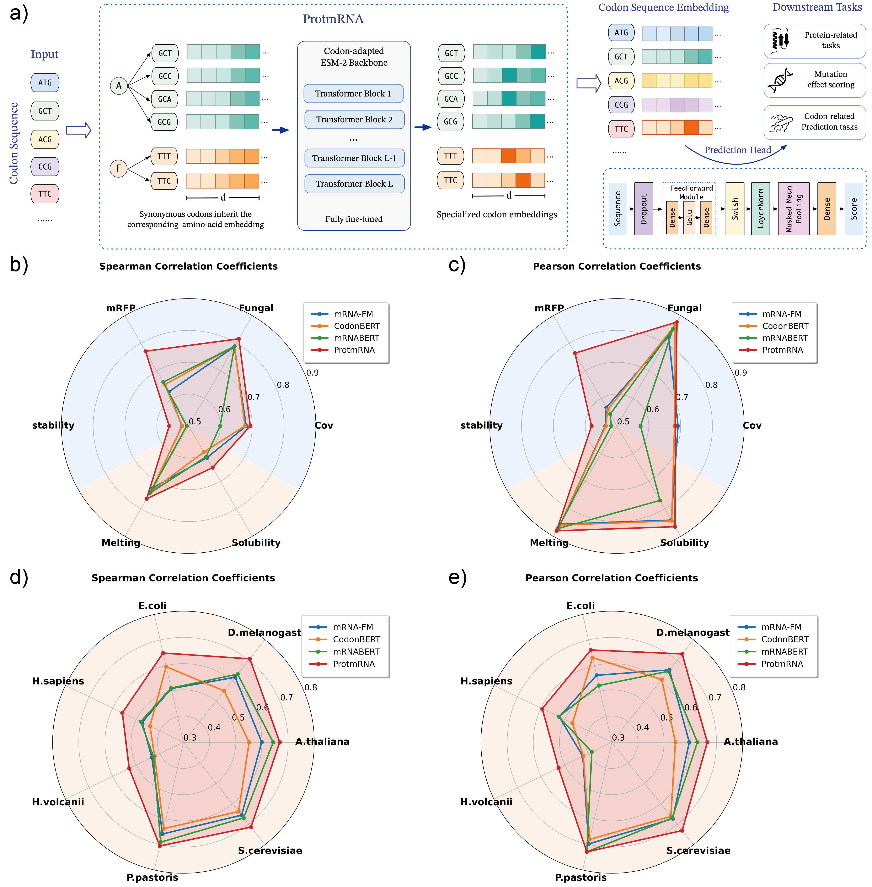
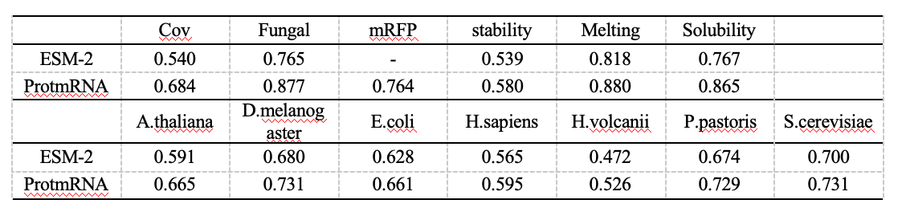

# ProtmRNA: Cross-Modal Knowledge Transfer from Proteins to Messenger RNA

Messenger RNA (mRNA) serves as the fundamental intermediary between genetic information and functional proteins, playing a central role in protein synthesis and gene expression regulation. According to the central dogma of molecular biology, mRNA sequences are directly translated into amino acid sequences, establishing an intrinsic biological correspondence between these two modalities. This natural connection suggests that mRNA sequence analysis could substantially benefit from the rich evolutionary and functional representations learned by large-scale protein language models.

To address this, we introduce ProtmRNA, a codon-level language model that repurposes the pre-trained ESM-2 protein language model for mRNA sequence processing via cross-modal transfer learning. ProtmRNA extends ESM-2's original amino-acid vocabulary to codon tokens and transfers protein-derived evolutionary and functional knowledge to mRNA sequence modeling. Evaluated on mRNA- and protein-related datasets, along with eight additional CDS-region regression benchmarks compiled in this study, ProtmRNA achieves performance comparable or superior to state-of-the-art mRNA language models while using less than half the pre-training computational resources.



### Overview and performance of ProtmRNA

Figure above shows the overall framework and performance of ProtmRNA. ProtmRNA adopts the pre-trained ESM-2 650M protein language model as the source domain for cross-modal knowledge transfer. The original amino-acid embedding space is extended to incorporate codon embeddings, enabling mRNA coding sequences to be processed at the codon level. The hidden dimension of ProtmRNA remains identical to ESM-2 at 1280.

For CDS-related downstream tasks, we evaluate ProtmRNA and other codon-based models on four regression tasks: SARS-CoV-2 vaccine degradation prediction, fungal gene expression prediction, mRFP expression prediction, and mRNA stability prediction. For protein-related tasks, we include two regression tasks: protein melting point prediction and protein solubility prediction. We also adopt the transcript abundance prediction benchmark across seven species from Xiong et al. As shown in Figure 1b-e, ProtmRNA achieves performance comparable or superior to other leading mRNA language models. 

We further compare ProtmRNA with its starting checkpoint, ESM-2 650M, as shown in the table below. The results show that ProtmRNA outperforms ESM-2 in most cases, even on protein-related tasks, confirming that our cross-modal knowledge transfer strategy enhances mRNA sequence understanding while preserving protein-related predictive capability.


## Usage

The input sequence should be pre-tokenized by spaces. Each token should be a codon.

```bash
cd ProtmRNA

python infer.py \
    --sequence "ATG GCT TTT CGA GGA" \
    --output_path outputs/feature.npy
```

Example output:

```text
input sequence:
ATG GCT TTT CGA GGA

decoded sequence:
ATG GCT TTT CGA GGA

feature shape: (1, 5, 1280)

feature saved to:
/path/to/ProtmRNA/outputs/feature.npy
```

The saved feature is a NumPy array with shape:

```text
1 × L × 1280
```

where `L` is the number of codon tokens in the input sequence.

## Feature Extraction

The core logic for extracting features from a codon sequence is shown below:

```python

input_sequence = "ATG GCT TTT CGA GGA"

my_model = ProtmRNA(n_layers=33,
                    d_model=1280,
                    n_heads=20,
                    d_ffn=1280*4,
                    vocab_size=78)

my_model(inputs=np.zeros((1, 1024)))
my_model.load_model(name="./models/ProtmRNA_weights.h5")

feature, decode_result = extract_feature_and_decode_from_sequence(
    my_model,
    input_sequence
)
```

## Dependency

    Python 3.7
    TensorFlow 2.4

The pre-trained model of ProtmRNA is hosted on [Google Drive](https://drive.google.com/file/d/1qP7Lg6axDs2eSeed-iPgDJMjmkO7wfKt/view?usp=sharing).

Please place the weight file in the following path before running feature extraction:

```text
ProtmRNA/models/ProtmRNA_weights.h5
```

